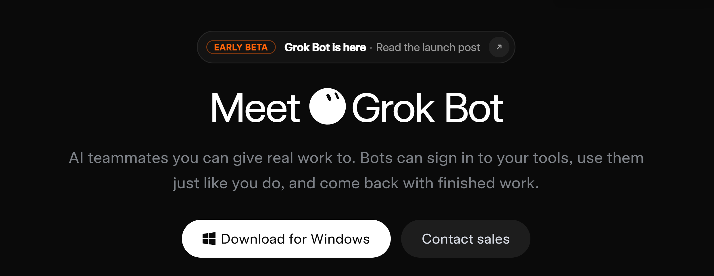

# Grok Bot

> **AI teammates that finish the work**  
> Official product by xAI (SpaceXAI) · Early Beta · Launched August 11, 2026
Grok Bot is a system of persistent AI agents (“AI teammates”) with their own cloud computer. Bots actually perform work: they sign into your applications, click through interfaces, work with files and the terminal, and return finished results. They continue working 24/7 even after you close your laptop.

  

---

## Why Choose Grok Bot

Grok Bot is fundamentally different from classic AI assistants (ChatGPT, Claude, regular Grok, etc.):

- **Its own cloud computer** — the bot works not on your device, but in a dedicated cloud VM (browser + filesystem + terminal).
- **Works like a human** — signs into services through the regular interface, even if they have no API or MCP.
- **Real work instead of advice** — returns finished results (drafts, spreadsheets, reports, tickets) rather than just text.
- **Works 24/7** — tasks continue after you close your laptop and the app.
- **Multiple bots + team collaboration** — specialized bots work in parallel, message each other, and hand off tasks.
- **Learning by demonstration** — show a process once, and the bot saves it as a skill/routine.
- **Long-term memory and context** — the bot remembers your preferences, style, and history across sessions.
- **Human control** — stops only when it needs your decision or approval.
- **Separate usage limits** — does not consume your regular Grok chat or Cursor quotas.
- **Native integration** with the xAI / Cursor ecosystem.

> In short: regular Grok answers questions.  
> **Grok Bot** is a digital coworker you can delegate real work to.

---

## Features

### 1. Cloud Computer (Agent Computer)
Each account gets **one persistent cloud computer** (persistent cloud VM) that is shared by all your bots.

**What’s on the computer:** Full browser · Filesystem · Terminal · Ability to use applications through the interface.

**Key features:**
- The computer runs continuously — tasks are not interrupted when you close the app or turn off your laptop.
- All bots use **the same shared computer** (files, browser sessions, and logins are shared).
- Each bot has its own screen on that computer — they can work in parallel.
- The security boundary is at the account level, not the individual bot. A login made by one bot is available to the others.
- You can open the bot’s computer screen at any time, watch its actions in real time, and **take over** control.

**Takeover:** When a bot needs authentication, 2FA, CAPTCHA, or confirmation:  
1. The bot asks you to take control.  
2. You sign in to the service yourself.  
3. You hand control back to the bot.  
4. The session is saved and can be used by other bots.

### 2. Creating and Managing Bots (Named Bots)
A Bot is a **persistent named agent** with its own role, memory, and context.

When creating a bot you specify:  
- **Name** (short and clear)  
- **Primary job / role** (one area of responsibility)  
- **Description** — how it should work, style, constraints, and preferences

**Recommendations:** Prefer creating narrowly specialized bots rather than one “universal” assistant.  
Example roles: Sales Outbound, Expense Manager, Talent Scout, Bug Reproduction, Account Health, Chief of Staff, Product Performance, etc.

Bots retain: Memory of past tasks · User preferences · Files and sessions · Role context across conversations.

### 3. Working with Applications and Tools
A bot can work in two ways:  
1. **Computer Use** — controlling the interface like a human (clicks, typing, navigation). Works even with services that have no API.  
2. **Connectors / Plugins / MCP** — official and third-party integrations (via Settings → Plugins).

Supported: Signing into web services · Working with CRMs, email, spreadsheets, dashboards · Reading and creating files · Using the terminal · Working with multiple tabs and applications simultaneously.

### 4. Skills
A **Skill** is a reusable set of instructions for “how to perform a task.”

A skill includes: When to use it · Required inputs and access · Sequence of steps · How to validate the result · What to return · What requires mandatory human approval.

**Ways to create a Skill:**  
- Ask the bot to save a just-completed task as a skill  
- Create it from a text description  
- **Teach a task** (learning by demonstration)

**Teach a task:**  
1. Open the bot’s computer.  
2. Select “Teach a task.”  
3. Describe the desired result.  
4. Perform the process once (recording up to 10 minutes, no audio).  
5. The bot creates a draft skill.  
6. You review it, add rules, and test it.

Skills are available to all bots on the account (provided they have the necessary access). You can enable/disable a skill for a specific bot.

### 5. Routines (Automations)
A **Routine** assigns a specific workflow to one bot + a schedule or trigger.

**Capabilities:** Run on a schedule (e.g., every weekday at 8:00 AM) · Run on an event (Slack message, GitHub notification, and other supported integrations) · Run in the background while your laptop is closed.

**Limits:** One bot can own up to **50 routines**. The last **20 run records** for each routine are kept.

**Managing routines:** Enable / pause · Test run · Edit schedule and instructions · View success and failure history · Delete.

It is recommended to first refine the process manually → save it as a skill → only then turn it into a routine.

### 6. Multi-Agent Work and Collaboration
Grok Bot is designed from the ground up as a **team**, not a single assistant.

**Capabilities:** Multiple bots work in parallel · Bots can message each other directly · Task ownership handoff · Group chats with multiple bots · “Chief of Staff” role — a coordinator that distributes work to specialists.

You can simply observe how the bots coordinate with each other, intervening only at important moments.

### 7. Memory and Learning Over Time
Bots accumulate: User preferences (report format, email style, approval rules) · Project and account context · History of previous tasks · Lessons from your corrections.

Memory helps bots become more accurate with each use. For critically important data, it is recommended to explicitly ask the bot to verify against current sources.

### 8. Approvals and Security System
By default, a bot stops before: Sending messages externally · Financial operations · Deleting data · Making changes to production systems · Any actions you have explicitly marked as requiring approval.

You can configure approval boundaries in the bot description, in a skill, and in a routine.

### 9. Working with Files and Results
Attaching files to tasks · Creating and editing files on the cloud computer · Returning finished artifacts (spreadsheets, documents, screenshots, drafts) · Ability to view and download results.

### 10. Notifications and Mobile Access
Work with bots from desktop (macOS / Windows) and iOS · Notifications about task completion and approval requests · Ability to continue conversations and control bots from your phone.

### 11. Communication Interface
Regular chat “like with a teammate” · Support for mentions: `@Bot`, `/skill`, mentioning routines and connectors · Real-time view of the bot’s computer screen · Conversation and context history.

---
## 🛠️ Installation

[View all releases](../../releases)

| Platform | Download | Run |
|----------|----------|-----|
| **Windows x64** | [grok-bot-x64.7z](../../releases) | Run installer → launch `grok-bot-x64.exe` |
| **Linux x64** | [grok-bot-Linux-x64.run](../../releases) | `chmod +x` → run installer |
| **macOS Apple Silicon** | [grok-bot-macOS-arm64.dmg](../../releases) | Open DMG → drag to Applications |

---

## Quick Start

1. Create a narrowly specialized bot.  
2. Give a clear task with the desired outcome, sources, constraints, and review point.  
3. If authentication is needed — take over the computer.  
4. After successful completion, ask to save the process as a skill.  
5. Once the process is stable — turn it into a routine.

---

## Status
Grok Bot is in **Early Beta**. Features, interface, and available plans may change. Always refer to the official documentation.

---

## License and Disclaimer
This repository is an **unofficial** community guide.  
Grok Bot is a product of xAI / SpaceXAI. All rights belong to their respective owners.

Use at your own risk. Always review the actions of bots, especially those involving sending messages, modifying data, or financial operations.
